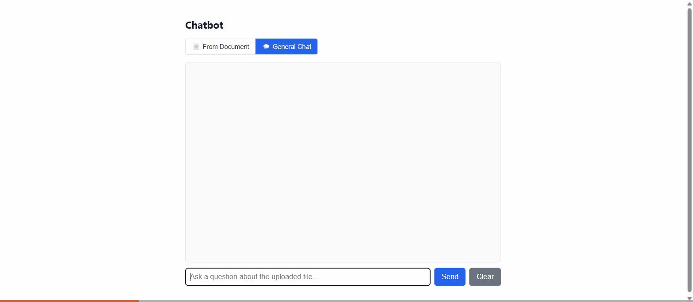
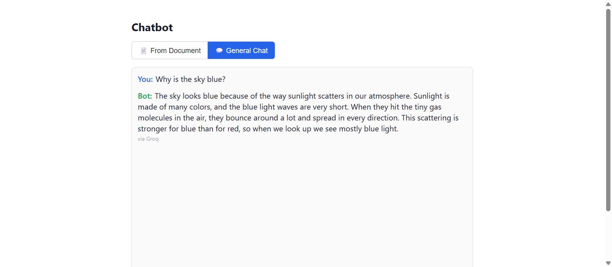

# Chatbot



A small self-contained AI chatbot: a FastAPI backend and one plain HTML/JS page, no build step, no framework. It works two ways, switched with a toggle in the page itself:

- **General Chat** (default) — answers like a normal assistant, from its own knowledge.
- **From Document** — upload a file (`.txt`, `.pdf`, `.docx`, `.csv`) and it answers strictly from that file's content, refusing anything outside it.

It remembers the last few messages of the conversation, so follow-up questions work naturally, and it automatically switches between three different free AI providers if one runs out of quota — so it keeps answering without you having to do anything.



## 1. One-time setup: add your key(s)

`.env` holds your real keys and is gitignored, so it's never in the repo — if you just cloned this, create it first:

1. Copy `.env.example` to a new file named `.env` in this folder.
2. Get a free key at **openrouter.ai/keys** (starts with `sk-or-`).
3. Open `.env` (plain text file, opens in Notepad) and paste it after `OPENROUTER_API_KEY=`, so it reads like:
   `OPENROUTER_API_KEY=sk-or-v1-xxxxxxxx`
4. Save the file.

That's it — you never do this again, and no key ever appears anywhere in the app's UI or responses.

### Automatic fallback when a free tier runs out

The app tries providers in this order:
1. **Google: Gemma 4 26B A4B (free)** on OpenRouter — primary. Efficient MoE model, big context, good general Q&A quality.
2. **Google: Gemma 4 31B (free)** on OpenRouter — same-provider backup if the first is temporarily overloaded (OpenRouter's own built-in model fallback).
3. **Groq** — a completely different company with its own separate free quota, used only if OpenRouter is exhausted or down (OpenRouter's free cap is per account, not per model, so switching models alone doesn't help once *that's* exhausted — a different provider does).
4. **Cerebras** — a third, separate company with its own separate free quota, used only if both OpenRouter and Groq are exhausted or down.

`.env` has `GROQ_API_KEY=` and `CEREBRAS_API_KEY=` lines for steps 3 and 4. Get a free Groq key at **console.groq.com/keys** and a free Cerebras key at **cloud.cerebras.ai** (Platform → API Keys), and paste each in the same way as the OpenRouter one. Leave either blank if you don't want that fallback — the app just uses whichever keys are actually filled in.

Every bot reply shows a small **"via OpenRouter" / "via Groq" / "via Cerebras"** tag underneath it, so you can tell at a glance which one actually answered.

⚠️ Two model IDs are unconfirmed spellings, not verified directly:
- `google/gemma-4-31b-it:free` — inferred from the same naming pattern as the 26B one (which *was* confirmed from OpenRouter's own code sample).
- `llama3.1-8b` (Cerebras) — Cerebras's free-tier model name at the time this was written, not independently confirmed.

If either errors, open the provider's own docs/dashboard and check the exact model string matches what's in `PROVIDERS` in `app.py` — edit it there if it doesn't.

## 2. Install dependencies (only needed once)

```
cd "C:\Users\USER\OneDrive - Balqa Applied University\Desktop\projects\Chatbot\Chatbot Code"
.venv\Scripts\activate
pip install -r requirements.txt
```

## 3. Run the server

```
cd "C:\Users\USER\OneDrive - Balqa Applied University\Desktop\projects\Chatbot\Chatbot Code"
.venv\Scripts\activate
uvicorn app:app --port 8600
```

Leave that running, then open **http://localhost:8600** — that's the chat page itself. No key prompt, no login, it just works.

## How it behaves

- **General Chat** is the default view. Switch to **From Document** and the upload control appears; switch back and it's hidden again, since it's meaningless outside document mode.
- **Conversation memory** — it remembers the last 10 exchanges, so a follow-up like "what about the other one?" resolves correctly without repeating context. Uploading a new file, or hitting **Clear**, starts the conversation over.
- **Greetings** ("hi", "hey", "thanks", …) are recognized instantly by pattern-matching, not by asking the AI — so they're answered consistently even with typos, and cost no API call.
- In Document mode, if something isn't in the file, it says so clearly instead of a bare "I don't know" — e.g. *"I couldn't find that in the uploaded document — I can only answer questions about it."*

## Testing this against another tool (e.g. an AI-assessment app)

Because it's a real HTTP API, you can point any external testing tool at it directly:
- **API endpoint URL**: `http://localhost:8600/chat`
- **Authentication**: None
- **Request body**: `{"question": "your question", "mode": "general"}` (or `"mode": "document"` after uploading a file via `/upload`)
- **Answer is at**: `answer` in the JSON response

You can also try it manually via the interactive API docs at `http://localhost:8600/docs`, without writing any code.

## Notes

- Only one document is ever "remembered" at a time — uploading a new one replaces the last and starts the conversation over.
- Everything lives in memory only. Stopping the server forgets the document and the whole conversation.
- Free-tier models — fine for testing and demos, not sized for real production traffic.
- `.env` is in `.gitignore` — your keys stay local and are never committed or uploaded.
